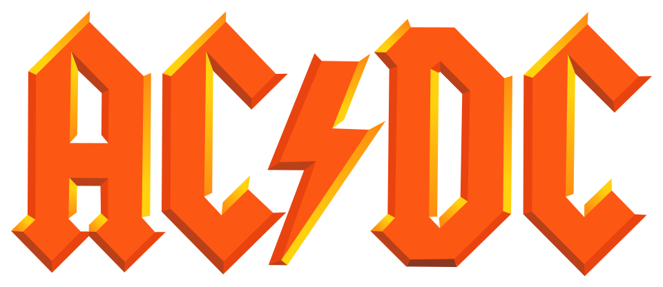

<h1 align="center">Hello, I’m Amir 👋</h1>

  Front-End Developer with a strong eye for UI, layout, and clean visual systems.

---

### What I do

I build clean interfaces using modern front-end tools.

My work sits between **design and code** — creating scalable interfaces, reusable UI systems, and digital products that balance visual quality with clean technical execution.

---

### How I work

- Map the problem before designing the screen  
- Turn requirements into structured flows and component systems  
- Build reusable UI that can scale beyond one page  
- Polish responsiveness, performance, and interaction states  
- Ship clean, maintainable work that teams can build on

---

### Tech I use

`React` · `Next.js` · `TypeScript` · `JavaScript` · `Tailwind CSS` · `Supabase` · `AWS` · `MapLibre` · `Figma` · `Framer Motion`

---

### A few facts

- Prefer Mike Mentzer over Arnold  
- I prefer classic cinema  
- Big AC/DC fan 

